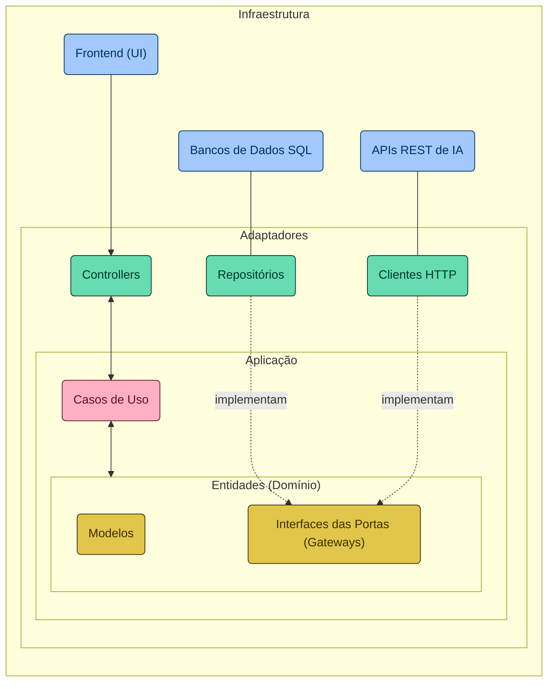
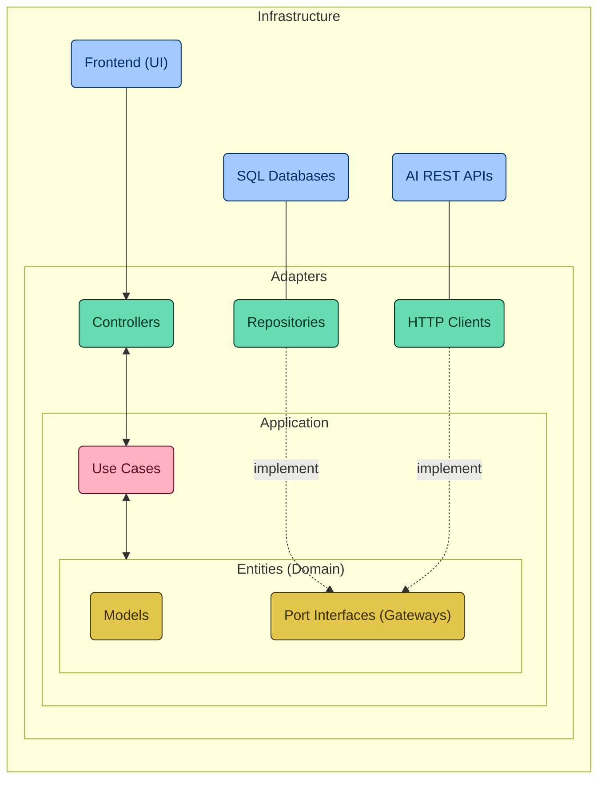

# NeuroChatIA: Documentação do Projeto

## Índice
1. [Introdução](#introdução)
2. [Diagrama Arquitetural](#diagrama-arquitetural)
3. [Estrutura de Diretórios do Projeto](#estrutura-de-diretórios-do-projeto-neurochatia)
4. [Configuração do Spring Boot](#configuração-do-spring-boot)
5. [Integração com Bancos de Dados SQL](#integração-com-bancos-de-dados-sql)
6. [API REST para Campeões do League of Legends](#api-rest-para-campeões-do-league-of-legends)
7. [Inteligência Artificial com Spring Cloud OpenFeign](#inteligência-artificial-com-spring-cloud-openfeign)
8. [Interface do Usuário com HTML, CSS e JavaScript](#interface-do-usuário-com-html-css-e-javascript)

## Introdução
O projeto **NeuroChatIA** é um sistema que combina os fundamentos da linguagem de programação Java com as configurações do framework Spring Boot. Nosso foco principal está na Programação Orientada a Objetos e na integração com Bancos de Dados SQL por meio do Spring Data JDBC. O objetivo é desenvolver uma API REST abordando o design, desenvolvimento e documentação, com ênfase em campeões do jogo League of Legends. A API será implantada no AWS Elastic Beanstalk. Além disso, incorporaremos uma camada de Inteligência Artificial (IA) para otimizar a API, utilizando o Spring Cloud OpenFeign para integração com APIs de IA fornecidas por grandes provedores, como OpenAI (GPT) e Google (Gemini). A interface do usuário será construída para interagir com a API, explorando os conceitos básicos de HTML, CSS e JavaScript.

## Diagrama Arquitetural
A seguir, apresentamos o diagrama arquitetural do projeto, destacando a separação das responsabilidades entre as camadas. Desde a interface de usuário até os mecanismos de interação com sistemas externos, passando por adaptadores, casos de uso e as entidades centrais do domínio, cada elemento é estrategicamente posicionado para reforçar a modularidade, a escalabilidade e a manutenibilidade do sistema. Esta estrutura facilita a compreensão de como os componentes colaboram para a realização dos objetivos do software, alinhando-se aos princípios da Clean Architecture.

classDef infra fill:#a3c9ff,stroke:#00315c,color:#00315c;
classDef adapters fill:#67dbb1,stroke:#003828,color:#003828;
classDef ucs fill:#ffb1c1,stroke:#5f112b,color:#5f112b;
classDef entities fill:#e2c54b,stroke:#3a3000,color:#3a3000;

class BD,EXT,UI infra;
class Controller,Repo,HTTP adapters;
class UC ucs;
class Model,IPort entities;

## Estrutura de Diretórios do Projeto NeuroChatIA

O projeto **NeuroChatIA** segue uma estrutura de diretórios inspirada nos princípios da Clean Architecture, visando à clara separação de responsabilidades e à promoção da autonomia das camadas em um projeto Spring Boot. Essa abordagem não apenas facilita a manutenção e evolução do código, mas também sustenta a integração e colaboração eficaz entre as diferentes partes da aplicação. A seguir, detalhamos a disposição dos diretórios que compõem a aplicação, cada um desempenhando um papel específico dentro do ecossistema de software:

- **adapters/**: Adaptadores para comunicação entre a aplicação e o mundo externo, incluindo controladores REST e componentes de persistência.

- **in/**: Adaptadores de entrada, lidando com requisições de usuários.

- **out/**: Adaptadores de saída, responsáveis pela interação com bancos de dados e APIs externas.

- **application/**: Casos de uso da aplicação, encapsulando a lógica de negócios.

- **domain/**: Entidades, exceções e interfaces que definem as regras de negócio do domínio.

- **exception/**: Exceções personalizadas pertinentes ao domínio.

- **model/**: Modelos de dados que representam conceitos centrais da aplicação.

- **ports/**: Interfaces que delineiam os contratos para adaptadores e serviços externos.

- **Application.java**: Classe principal que configura e inicia a aplicação Spring Boot.

## Configuração do Spring Boot

A configuração do Spring Boot no projeto **NeuroChatIA** envolve a definição de diversas classes e componentes que permitem a inicialização e execução da aplicação de forma eficiente e robusta. Algumas das principais configurações incluem:

- **Classe Principal (`Application.java`)**: Esta classe contém o método `main()` responsável por iniciar a aplicação Spring Boot. Ela também é utilizada para configurar os componentes principais do Spring, como beans, escaneamento de pacotes e propriedades de aplicação.

- **Configuração do Banco de Dados**: O Spring Boot permite configurar facilmente a conexão com o banco de dados por meio de propriedades no arquivo `application.properties` ou `application.yml`. No caso do **NeuroChatIA**, estamos utilizando o banco de dados H2 para armazenar dados dos campeões do League of Legends.

- **Configuração da API REST**: Utilizando anotações como `@RestController`, `@RequestMapping`, e `@Autowired`, definimos endpoints REST que expõem funcionalidades relacionadas aos campeões. O Spring Boot gerencia automaticamente a serialização e desserialização de dados JSON.

- **Configuração da Segurança**: Podemos integrar e configurar facilmente módulos de segurança, como autenticação e autorização, utilizando as dependências do Spring Security.

## Integração com Bancos de Dados SQL
No projeto **NeuroChatIA**, utilizamos o banco de dados H2 para modelar o domínio dos campeões do League of Legends. Isso facilita a prototipação rápida e eficiente, permitindo armazenar informações detalhadas sobre cada campeão.

## API REST para Campeões do League of Legends

A API REST no **NeuroChatIA** fornece operações para acessar informações sobre os campeões do League of Legends. Alguns exemplos de endpoints que podem ser implementados incluem:

- `GET /api/champions`: Retorna a lista de todos os campeões disponíveis.
- `GET /api/champions/{id}`: Retorna os detalhes de um campeão específico com o ID fornecido.
- `POST /api/champions`: Cria um novo campeão com base nos dados fornecidos.
- `PUT /api/champions/{id}`: Atualiza as informações de um campeão existente com o ID fornecido.
- `DELETE /api/champions/{id}`: Remove um campeão com o ID fornecido.

Esses endpoints são implementados nos controladores REST do Spring Boot e são acessíveis por meio de requisições HTTP.

## Inteligência Artificial com Spring Cloud OpenFeign

Para incorporar Inteligência Artificial (IA) ao **NeuroChatIA**, utilizamos o Spring Cloud OpenFeign para integrar-se facilmente com APIs de IA de grandes provedores, como OpenAI (GPT) e Google (Gemini). Algumas etapas importantes desta integração incluem:

- **Definição das Interfaces de Cliente**: Criamos interfaces de cliente com anotações Feign para definir os endpoints e as operações que serão consumidas das APIs de IA.

- **Configuração do Feign Client**: Utilizando anotações como `@FeignClient` e `@RequestMapping`, configuramos e injetamos os clientes Feign para se comunicar com as APIs de IA externas.

- **Integração com os Serviços de IA**: Podemos então chamar diretamente os métodos dos clientes Feign em nosso código para interagir com os serviços de IA externos, como gerar texto com base em uma entrada específica.

## Interface do Usuário com HTML, CSS e JavaScript

A interface do usuário (UI) do **NeuroChatIA** é construída utilizando conceitos básicos de HTML, CSS e JavaScript para fornecer uma experiência interativa e amigável aos usuários. Alguns elementos importantes da interface incluem:

- **Páginas HTML**: Criamos várias páginas HTML para representar diferentes partes da aplicação, como página inicial, visualização de campeões e formulários de interação.

- **Estilização com CSS**: Utilizamos folhas de estilo CSS para estilizar os elementos HTML, como cores, fontes, tamanhos e layouts.

- **Interações Dinâmicas com JavaScript**: Incorporamos scripts JavaScript para adicionar comportamentos dinâmicos à interface do usuário, como validação de formulários, carregamento assíncrono de dados e interatividade com elementos da página.

# Contribuidores

O projeto **NeuroChatIA** foi desenvolvido com a contribuição de:

- **Daniel Martins** - Desenvolvedor Full Stack, especializado em Java e Spring Boot. Contribuiu com a implementação da lógica de negócios, integração com bancos de dados e configuração do Spring Boot.
  Veja o perfil de Daniel Martins no [GitHub](https://github.com/Danielmadr).

- **Yasmin Barcelos** - Desenvolvedor Full Stack, especializado em Java e Spring Boot. Contribuiu com a implementação da lógica de negócios, integração com bancos de dados e configuração do Spring Boot.
  Veja o perfil de Yasmin Barcelos no [GitHub](https://github.com/yxsbx).

  ***

# NeuroChatIA: Project Documentation

## Table of Contents
1. [Introduction](#introduction)
2. [Architectural Diagram](#architectural-diagram)
3. [Project Directory Structure](#project-directory-structure-for-neurochatia)
4. [Spring Boot Configuration](#spring-boot-configuration)
5. [Integration with SQL Databases](#integration-with-sql-databases)
6. [REST API for League of Legends Champions](#rest-api-for-league-of-legends-champions)
7. [Artificial Intelligence with Spring Cloud OpenFeign](#artificial-intelligence-with-spring-cloud-openfeign)
8. [User Interface with HTML, CSS, and JavaScript](#user-interface-with-html-css-and-javascript)
9. [Contributors](#contributors)

## Introduction
The **NeuroChatIA** project is a system that combines Java programming language fundamentals with Spring Boot framework configurations. Our main focus is on Object-Oriented Programming and integration with SQL databases through Spring Data JDBC. The goal is to develop a REST API covering design, development, and documentation, with a focus on League of Legends champions. The API will be deployed on AWS Elastic Beanstalk. Additionally, we will incorporate an Artificial Intelligence (AI) layer to optimize the API, using Spring Cloud OpenFeign for integration with AI APIs provided by major providers like OpenAI (GPT) and Google (Gemini). The user interface will be built to interact with the API, exploring basic concepts of HTML, CSS, and JavaScript.

## Architectural Diagram
Below is the architectural diagram of the project, highlighting the separation of responsibilities among layers. From the user interface to interactions with external systems, passing through adapters, use cases, and core domain entities, each element is strategically positioned to reinforce system modularity, scalability, and maintainability. This structure facilitates understanding of how components collaborate to achieve software goals, aligning with Clean Architecture principles.

classDef infra fill:#a3c9ff,stroke:#00315c,color:#00315c;
classDef adapters fill:#67dbb1,stroke:#003828,color:#003828;
classDef ucs fill:#ffb1c1,stroke:#5f112b,color:#5f112b;
classDef entities fill:#e2c54b,stroke:#3a3000,color:#3a3000;

class BD,EXT,UI infra;
class Controller,Repo,HTTP adapters;
class UC ucs;
class Model,IPort entities;

## Project Directory Structure for NeuroChatIA

The **NeuroChatIA** project follows a directory structure inspired by Clean Architecture principles, aiming for clear separation of responsibilities and promoting autonomy of layers in a Spring Boot project. This approach not only facilitates code maintenance and evolution but also supports effective integration and collaboration among different parts of the application. Below, we detail the layout of directories that compose the application, each playing a specific role within the software ecosystem:

- **adapters/**: Adapters for communication between the application and the outside world, including REST controllers and persistence components.

- **in/**: Input adapters, handling user requests.

- **out/**: Output adapters, responsible for interacting with databases and external APIs.

- **application/**: Application use cases, encapsulating business logic.

- **domain/**: Entities, exceptions, and interfaces defining domain business rules.

- **exception/**: Custom domain-relevant exceptions.

- **model/**: Data models representing core application concepts.

- **ports/**: Interfaces delineating contracts for adapters and external services.

- **Application.java**: Main class configuring and starting the Spring Boot application.

## Spring Boot Configuration

The Spring Boot configuration in the **NeuroChatIA** project involves defining various classes and components that enable the initialization and execution of the application efficiently and robustly. Some key configurations include:

- **Main Class (`Application.java`)**: This class contains the `main()` method responsible for starting the Spring Boot application. It's also used to configure core Spring components such as beans, package scanning, and application properties.

- **Database Configuration**: Spring Boot allows easy configuration of database connection through properties in `application.properties` or `application.yml`. In the case of **NeuroChatIA**, we're using the H2 database to store League of Legends champions' data.

- **REST API Configuration**: Using annotations like `@RestController`, `@RequestMapping`, and `@Autowired`, we define REST endpoints exposing functionalities related to champions. Spring Boot automatically manages JSON data serialization and deserialization.

- **Security Configuration**: We can easily integrate and configure security modules like authentication and authorization using Spring Security dependencies.

## Integration with SQL Databases

In the **NeuroChatIA** project, we use the H2 database to model the domain of League of Legends champions. This enables quick and efficient prototyping, allowing storage of detailed information about each champion.

## REST API for League of Legends Champions

The REST API in **NeuroChatIA** provides operations to access information about League of Legends champions. Some example endpoints that can be implemented include:

- `GET /api/champions`: Returns the list of all available champions.
- `GET /api/champions/{id}`: Returns details of a specific champion with the provided ID.
- `POST /api/champions`: Creates a new champion based on provided data.
- `PUT /api/champions/{id}`: Updates information of an existing champion with the provided ID.
- `DELETE /api/champions/{id}`: Removes a champion with the provided ID.

These endpoints are implemented in Spring Boot's REST controllers and are accessible via HTTP requests.

## Artificial Intelligence with Spring Cloud OpenFeign

To incorporate Artificial Intelligence (AI) into **NeuroChatIA**, we use Spring Cloud OpenFeign to easily integrate with AI APIs from major providers like OpenAI (GPT) and Google (Gemini). Some important steps of this integration include:

- **Definition of Client Interfaces**: We create client interfaces with Feign annotations to define endpoints and operations that will be consumed from external AI APIs.

- **Feign Client Configuration**: Using annotations like `@Feign

Client` and `@RequestMapping`, we configure and inject Feign clients to communicate with external AI APIs.

- **Integration with AI Services**: We can then directly call methods of Feign clients in our code to interact with external AI services, like generating text based on specific input.

## User Interface with HTML, CSS, and JavaScript

The user interface (UI) of **NeuroChatIA** is built using basic concepts of HTML, CSS, and JavaScript to provide an interactive and user-friendly experience. Some important elements of the interface include:

- **HTML Pages**: We create various HTML pages to represent different parts of the application, such as home page, champion views, and interaction forms.

- **Styling with CSS**: We use CSS stylesheets to style HTML elements, including colors, fonts, sizes, and layouts.

- **Dynamic Interactions with JavaScript**: We incorporate JavaScript scripts to add dynamic behaviors to the UI, such as form validation, asynchronous data loading, and interactivity with page elements.

## Contributors

The **NeuroChatIA** project was developed with contributions from:

- **Daniel Martins** - Full Stack Developer, specializing in Java and Spring Boot. Contributed to business logic implementation, database integration, and Spring Boot configuration.
  See Daniel Martins' profile on [GitHub](https://github.com/Danielmadr).

- **Yasmin Barcelos** - Full Stack Developer, specializing in Java and Spring Boot. Contributed to business logic implementation, database integration, and Spring Boot configuration.
  See Yasmin Barcelos' profile on [GitHub](https://github.com/yxsbx).
